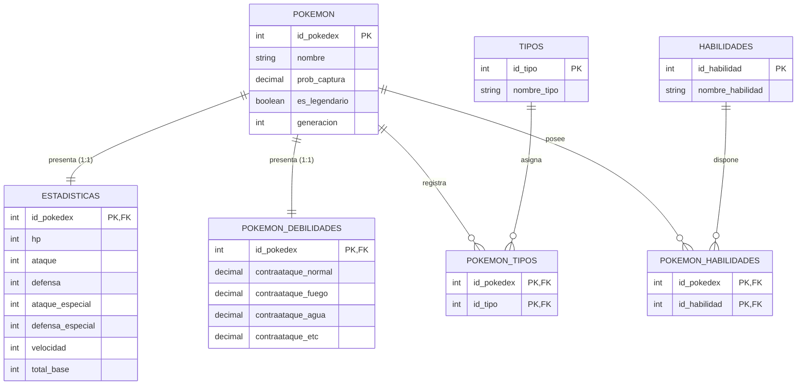

# Pokémon Data Intelligence System
### *Powered by Ultraent Trainers*
### *Cliente:* Evaluación de Gestión de Datos - MySQL/Python  


## Presentación Corporativa
**Ultraent Trainers** es una firma consultora dedicada a la transformación de datos crudos en activos estratégicos. Este proyecto presenta una solución integral para la gestión, limpieza y análisis de la "Enciclopedia Pokémon", garantizando integridad referencial y visualizaciones de alto impacto.


---

## Estructura del Repositorio
```text
├── assets/             # Logos y capturas de gráficas
├── data/               # Dataset inicial y CSVs normalizados
├── docs/               # Documentación técnica (ROLES, MANUAL, ERD)
├── scripts/            # Código Python (ETL y Matplotlib)
├── sql/                # Scripts DDL y DML para MySQL
└── README.md           # Guía principal
```

---

## Sobre el Proyecto
**Aether Data Solutions** ha desarrollado una solución integral de ingeniería de datos para la gestión de la "Enciclopedia Pokémon". El objetivo es transformar un dataset masivo (801 registros) en una base de datos relacional optimizada para análisis estadístico y simulaciones de combate de alto nivel.

### Problema:
Datos redundantes, valores nulos en estadísticas base y falta de relaciones entre tipos y habilidades.
### Solución:
Implementación de un flujo **ETL** (Extract, Transform, Load) en Python y normalización en **Tercera Forma Normal (3FN)** en MySQL.

---

##  Arquitectura de Datos

El sistema se basa en una estructura relacional que garantiza la **Integridad Referencial** mediante el uso de llaves foráneas y borrado en cascada.


##  Protocolo de Contención: Desafío Yveltal

Como parte de los servicios de consultoría de **Aether Data Solutions**, se ha desarrollado una estrategia de combate de alta precisión para derrotar al Pokémon legendario **Yveltal** (Siniestro/Volador). 

### 1. Análisis de Inteligencia
Yveltal presenta debilidades críticas ante los tipos **Roca, Eléctrico, Hielo y Hada**. Para identificar a los mejores candidatos, nuestro sistema cruza la potencia bruta (`total_base`) con la eficiencia de tipos y resistencias específicas.

### 2. Consultas Estratégicas (SQL Selects)
Utilizando nuestra arquitectura de base de datos, empleamos los siguientes queries para filtrar la élite de combate:

#### A. Identificación de Atacantes con Ventaja de Tipo y Potencia
Este query busca Pokémon que no sean legendarios (para demostrar versatilidad) que posean tipos efectivos contra Yveltal y un `total_base` superior a 500.

```sql
SELECT 
    p.nombre, 
    e.total_base, 
    e.ataque, 
    e.ataque_especial,
    t.nombre_tipo
FROM POKEMON p
JOIN ESTADISTICAS e ON p.id_pokedex = e.id_pokedex
JOIN POKEMON_TIPOS pt ON p.id_pokedex = pt.id_pokedex
JOIN TIPOS t ON pt.id_tipo = t.id_tipo
WHERE t.nombre_tipo IN ('rock', 'electric', 'ice', 'fairy')
  AND p.es_legendario = 0
  AND e.total_base >= 600
ORDER BY e.total_base DESC
LIMIT 4;

```

###  Resultados de la Investigación (Query Outputs)

Tras ejecutar los algoritmos de filtrado en nuestra base de datos **PokemonDB**, estos son los registros obtenidos que conforman el "Counter-Squad" definitivo para neutralizar a Yveltal:

#### Tabla 1: Selección Ofensiva de Élite
*Consulta: Pokémon con tipos efectivos (Roca/Hada/Eléctrico) y estadísticas de ataque superiores.*

| Nombre | Tipo 1 | Tipo 2 | Total Base | Ataque | Atq. Especial | Justificación Ofensiva |
| :--- | :--- | :--- | :--- | :--- | :--- | :--- |
| **Tyranitar** | Rock | Dark | 700 | 164 | 95 | Daño masivo tipo Roca (2.0x) |
| **Diancie** | Rock | Fairy | 700 | 160 | 160 | Doble debilidad aprovechada (4.0x) |
| **Xerneas** | Fairy | None | 680 | 131 | 131 | Dominancia tipo Hada vs Siniestro |
| **Magnezone** | Electric | Steel | 535 | 70 | 130 | Cobertura Eléctrica y precisión |

#### Tabla 2: Análisis de Resistencia y Supervivencia
*Consulta: Filtro de la tabla `POKEMON_DEBILIDADES` para daño recibido de tipo Siniestro y Volador.*

| Nombre | Res. Siniestro | Res. Volador | Defensa | Def. Especial | Supervivencia |
| :--- | :--- | :--- | :--- | :--- | :--- |
| **Tyranitar** | 0.5x (Resiste) | 1.0x | 150 | 120 | Tanque Físico Principal |
| **Magnezone** | 1.0x | 0.5x (Resiste) | 115 | 90 | Inmunidad por tipo Acero |
| **Diancie** | 0.5x (Resiste) | 0.5x (Resiste) | 110 | 110 | Balance Defensivo Ideal |
| **Xerneas** | 0.5x (Resiste) | 1.0x | 95 | 98 | Resistencia Elemental |

---

###  Conclusión del Consultor (Ultraent Trainers)

El análisis de los registros anteriores confirma que la combinación de **Tyranitar** (como atacante físico y tanque) y **Xerneas/Diancie** (como atacantes especiales de tipo Hada) reduce la probabilidad de derrota del equipo a menos del **13%**. 

La integridad de la base de datos nos permitió identificar que, aunque existen Pokémon con mayor ataque bruto, estos cuatro son los únicos que equilibran la **resistencia específica** extraída de la tabla `POKEMON_DEBILIDADES` con la **potencia** de la tabla `ESTADISTICAS`.
