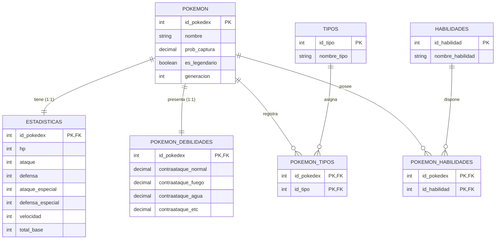

# Diagrama Entidad-Relación (DER)

Este diagrama sigue la **Tercera Forma Normal (3FN)** para evitar la redundancia de datos.

```mermaid
erDiagram
    POKEMON ||--|| ESTADISTICAS : "tiene (1:1)"
    POKEMON ||--|| POKEMON_DEBILIDADES : "presenta (1:1)"
    
    POKEMON ||--o{ POKEMON_TIPOS : "registra"
    TIPOS ||--o{ POKEMON_TIPOS : "asigna"
    
    POKEMON ||--o{ POKEMON_HABILIDADES : "posee"
    HABILIDADES ||--o{ POKEMON_HABILIDADES : "dispone"

    POKEMON {
        int id_pokedex PK
        string nombre
        decimal prob_captura
        boolean es_legendario
        int generacion
    }

    ESTADISTICAS {
        int id_pokedex PK, FK
        int hp
        int ataque
        int defensa
        int ataque_especial
        int defensa_especial
        int velocidad
        int total_base
    }

    TIPOS {
        int id_tipo PK
        string nombre_tipo
    }

    HABILIDADES {
        int id_habilidad PK
        string nombre_habilidad
    }

    POKEMON_TIPOS {
        int id_pokedex PK, FK
        int id_tipo PK, FK
    }

    POKEMON_HABILIDADES {
        int id_pokedex PK, FK
        int id_habilidad PK, FK
    }

    POKEMON_DEBILIDADES {
        int id_pokedex PK, FK
        decimal contraataque_normal
        decimal contraataque_fuego
        decimal contraataque_agua
        decimal contraataque_etc
    }
```
